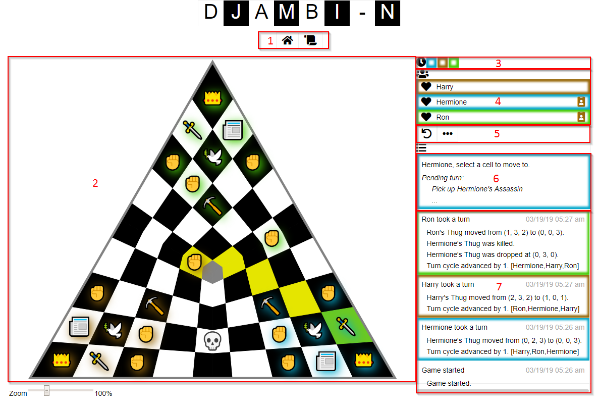

# Game UI

1. **Navigation bar**
    - These buttons navigate to other pages in the application. Every page has some navigation options available here.
2. **Board**
    - This is where the spatial state of the game is displayed.
    - Cells that are highlighted yellow can be selected. Cells that are highlighted green have already been selected as part of the current turn. Clicking on cells selects them.
    - There is a zoom control at the bottom. This will enlarge the board inside the frame. When zoomed in, scrollbars will appear in the frame.
3. **Turn cycle**
    - This is a display of the current order of player turns. The player whose turn it currently is is on the left.
    - The [rising to power](Rules.md#rising-to-power) mechanic makes this particularly important.
4. **Players**
    - This is a list of the players in the game. The order is always the order in which players joined.
    - Each row is highlighted in that player's color.  This can be used as a legend for colors in other parts of the UI.
    - On the left of each row is an icon indicating the player's status (heart = alive, skull = eliminated, etc.). Mouseover icons to see what they mean.
    - On the right, guest players will have an ID badge icon that is the color of the player they are a guest of.
5. **Actions**
    - This bar has buttons for currently available actions.  Mouseover icons to see what they mean.
    - Selecting cells is the only action that does not have a button here, because you click on the board.
    - The `...` button will display actions that are normally hidden (like conceding).
6. **Current turn**
    - This panel displays in two different ways.
    - If it is your turn, it prompts you to perform the next required action and shows a summary of the turn in progress.
    - If it is not your turn, it just says "Waiting on X...".
7. **History**
    - This is a list of all events that have occured in the game, with the start on the bottom and current turn on top.