# Rules

Djambi-N is a variation on the Chess-inpsired board game [Djambi][1] by Jean Anesto. The rules below will first describe Djambi, and then how Djambi-N differs from Djambi.

___

## Djambi

Djambi is a _kind of_ like Chess, but with two major differences. Each of these two also motivates many smaller differences.
1. Djambi is designed for 4 players. 
    - In Chess you are just trying to outwit one opponent and you can sometimes plan several moves ahead. In Djambi you have many opponents and each will have turns before you get to move again. This makes long-term planning harder. It also allows for the possibility of alliances (or double-crossing).
    - In Chess you and your opponent each start on one side and move towards each other, like trench warefare or American football. In Djambi each player starts in a corner and there is no clear "forward" direction. Because of this, all pieces can move in any direction.
2. In Djambi, pieces never leave the board. 
    - In Chess your piece can "capture" your opponent's piece, which removes it from the board. In Djambi most pieces can "kill" opponent pieces, which turns the killed piece into a Corpse piece which is not controlled by any player. Corpses can act like obstacles or fortifications.

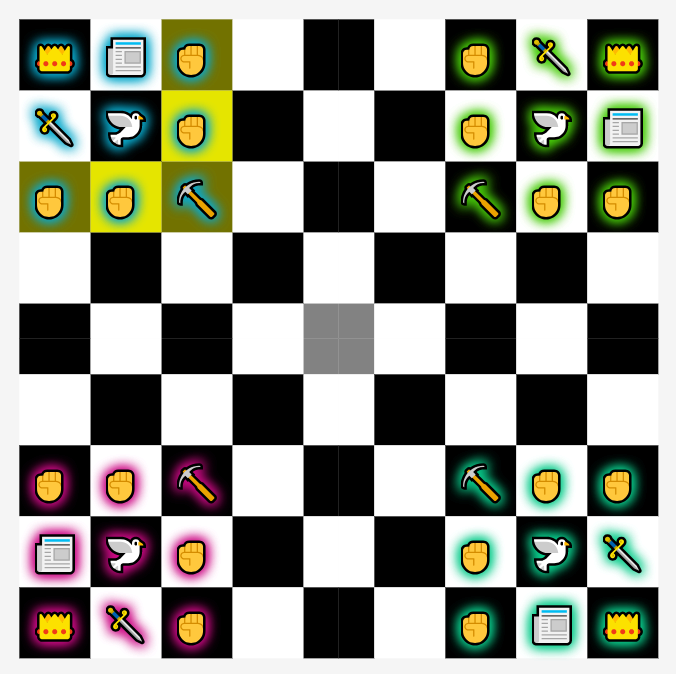

### The board
- Djambi is played on a 9x9 board, like a chess board but one bigger.
- The center square, called _The Seat_ has some special properties. (See **The Seat** section below.)

### The players
- The game is designed for 4 players, but can be played with 2 or 3 players (See **Less than 4 players** section below).
- Alliances, or any form of diplomacy or treachery, is allowed.
- The objective is to be the last player alive, so all alliances must be broken eventually.

### The pieces
- Each player has 9 pieces: 1 _Chief_, 1 _Assassin_, 1 _Journalist_, 1 _Diplomat_, 1 _Gravedigger_, and 4 _Thugs_. 
- All pieces can move in all 8 directions (horizontal, vertical, and diagonal).
- No pieces can "jump" over other pieces, like a _Knight_ in Chess.
- Most pieces can move any number of cells in a single direction, except the _Thug_.
- You cannot use a piece to kill another piece you control.

####  Corpse
- When a piece is killed, it becomes a _Corpse_. (Unlike Chess, where pieces are removed from the board.)
- Players cannot control _Corpses_; they act as obstacles.
- In Chess, you can bring back a captured piece by getting a _Pawn_ to the opposite side of the board. In Djambi, there is no way to bring a _Corpse_ back to life.

####  Thug 
- _(Militant in the original Djambi rules)_
- Can only move up to 2 cells. This is the only piece with a distance limitation.
- Plays a similar role to a _Pawn_ in Chess; numerous and expendable.
- Can move to any cell except _The Seat_.
- If the destination cell contains an enemy piece, the target piece is killed and the _Thug_'s controller places the _Corpse_ in any empty cell on the board, except _The Seat_.
	
####  Chief
- Plays a similar role to a _King_ in Chess; if you lose it, you lose. Unlike a _King_ in Chess, there is nothing like _being in check_. Players are free to put their _Chief_ in dangerous situations.
- Can move to any cell.
- If the destination cell contains an enemy piece, the target piece is killed and the _Chief_'s controller places the _Corpse_ in any empty cell on the board, except _The Seat_.
- If a player kills another player's _Chief_, the killing player takes control of any other remaining pieces controlled by the dead _Chief_'s controller.

####  Assassin
- Can move to any cell except _The Seat_, unless an enemy _Chief_ is there. 
- If the destination cell contains an enemy piece, the target piece is killed and its _Corpse_ is moved to the cell the _Assassin_ started its turn in.
- If an enemy _Chief_ is in _The Seat_, the _Assassin_ may move there to kill it, and then its controller gets another move to move the _Assassin_ out of _The Seat_. This secondary move must be to an empty cell; no double kills.

####  Journalist
- Can move to any **empty** cell except _The Seat_.
- After the _Journalist_ moves, if any enemy pieces are horizontally or vertically adjacent to its destination cell, the _Journalist_'s controller kills one of the adjacent enemies. Diagonally adjacent pieces cannot be killed. The targeted piece's _Corpse_ is left in place.
- A _Journalist_ may kill only one adjacent enemy. If there are any adjacent enemies, it's controller must kill one, they cannot opt out.
- If a _Journalist_ is moved by a _Diplomat_, they do not kill any enemies adjacent to where it is moved to.
- If a _Journalist_ kills a _Chief_ in _The Seat_, the _Chief_'s _Corpse_ stays in _The Seat_. This is the only way a piece other than a _Chief_ can stay in _The Seat_.

####  Diplomat
- Can move to any cell except _The Seat_, unless an enemy _Chief_ is there.
- If the destination cell contains an enemy piece, the _Diplomat_'s controller places the target piece in any empty cell on the board, **without** killing the target piece. 
- The _Diplomat_ cannot move any pieces except _Chiefs_ to _The Seat_.
- If an enemy _Chief_ is in _The Seat_, the _Diplomat_ may move there to move it, and then its controller gets another move to move the _Diplomat_ out of _The Seat_. This secondary move must be to an empty cell.

####  Gravedigger 
- _(Necromobile in the original Djambi rules)_
- Can move to any cell except _The Seat_, unless there is a _Corpse_ there.
- If the destination cell contains a _Corpse_, the _Gravedigger_'s controller places the _Corpse_ in any empty cell on the board, except _The Seat_.
- If the _Gravedigger_ moves to _The Seat_ to move a _Corpse_ out, its controller gets another move to move the _Gravedigger_ out of _The Seat_. This secondary move must be to an empty cell.

### Additional rules

#### The Seat
- _(The Maze in the original Djambi rules)_
- _The Seat_ is the center cell on the board. It is the only special cell.
- With some minor exceptions, only a _Chief_ may move to the _The Seat_.
- An _Assassin_ or _Diplomat_ may move there to get a _Chief_ out, but then they must make a secondary move to vacate _The Seat_. 
- If a _Journalist_ kills a _Chief_ in _The Seat_, the _Chief_'s _Corpse_ is left there.
- An _Gravedigger_ can move to _The Seat_ to remove the _Corpse_ left by a _Journalist_, but must make a secondary move to vacate.
- These secondary moves must be to an empty cell. (So, for example, an _Assassin_ cannot use this to make two kills in one turn.)
- Any piece may move through _The Seat_ (if it is empty) to get to another cell.

#### Surrounding
- If a _Chief_ that is not in _The Seat_ is surrounded by _Corpses_, it is killed and its _Corpse_ stays in the same cell.
- Any other pieces controlled by the same player become _abandoned_.
- A _Chief_ can be surrounded by _Corpses_ in _The Seat_ and not die, as long as its controller still has some possible moves with other pieces.

#### Out of Moves
- Similar to _surrounding_, if a player has no possible moves, their _Chief_ dies in place and any remaining pieces are _abandoned_.
- (This can happen if all of a player's pieces are clustered together and surrounded by _Corpses_, with no _Gravedigger_.)

#### Abandoned Pieces
- _Abandoned_ pieces are pieces on the board that are alive, but not controlled by any player. 
- They can be killed or moved by a _Diplomat_ like any other living piece.

#### Rising to Power
- When a _Chief_ moves to _The Seat_ if there are more than two players left, its controller _rises to power_. 
- A player in power gets to take a turn between each of the other players' turns. (If there are only two players left, this would not do anything.)
- When a _Chief_ leaves _The Seat_ (alive), its controller _falls from power_, and any extra pending turns its controller had are removed from the turn list, except the last one.
- When a player _rises to power_, they take control of any _abandoned_ pieces, and keep control of them even after they _fall from power_.
- **Tip:** When another player rises to power, it is a good time to form temporary alliances against them.

#### Less than 4 players
- When playing with only 2 or 3 players, _neutral_ players are created to fill the remaining player slots.
- _Neutral_ players do not take turns.
- Pieces controlled by a _neutral_ player can be killed or moved by a _Diplomat_ like any other living piece.
- If a player kills a _neutral_ player's _Chief_, they gain control of any other pieces controlled by that _neutral_ player.
- If a _neutral_ player's _Chief_ is _surrounded_, it dies and the remaining pieces controlled by that _neutral_ player are _abandoned_.
- When a player _rises to power_, they do **not** gain control of any pieces controlled by _neutral_ players.

#### Stalemate
- It is possible to end up with multiple _Chiefs_ still alive, but separated by walls of _Corpses_, with no _Gravediggers_ still alive to move them out of the way. In this case, there is no winner.

___

## Djambi-N

### Alternate geometries

The rules of Djambi (and Chess, Checkers, and many other games) contain an assumption that is often not true in our universe: that turning 90 degrees four times will get you back where you started.  

In some cases this assumption is true, like on a city map. Here, four 90-degree turns will get you back to where you started, parallel lines will never meet, and triangles will always have 180 degrees. Based on these features (which are all really the same feature) we can describe the city using [plane geometry][2], or say that it exists in space with no curvature.

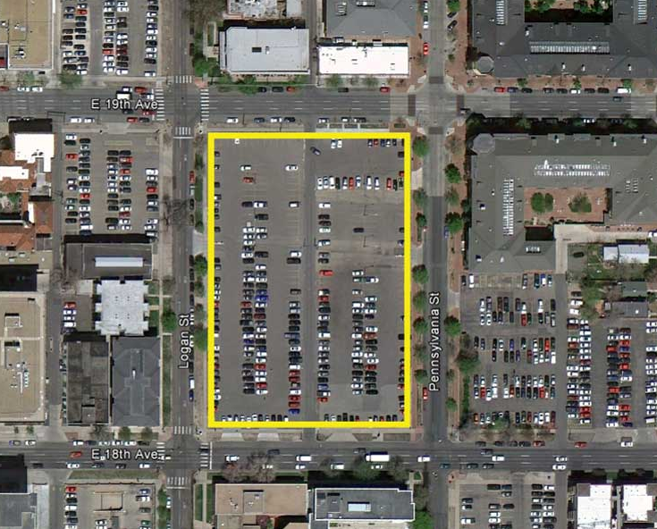

In other cases this assumption is false, like on the surface of a globe. Here, three 90-degree turns can get you back to where you started, parallel lines can meet (lines of longitude meet at the poles), and triangles can have more than 180 degrees. This surface can be described using [spherical geometry][3], and it has positive curvature.

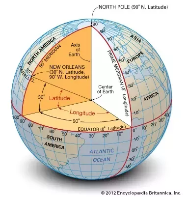

Another case where this is false is on concave surfaces. Here, more than four 90-degree turns can get you back to where you started, parallel lines can get further and further away, and triangles can have less than 180 degress. These surfaces can be described using [hyperbolic geometry][4], and they have negative curvature. At larger scales, the universe is shaped this way.

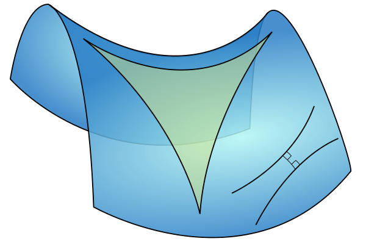

### So what does this have to do with Djambi-N?

The main difference between Djambi and Djambi-N is that Djambi-N gives you the option to play on boards with different curvatures. You can choose a board with __N__ sides (where N is between 3 and 8), and on that board you may need __N__ 90-degree turns to get back to where you started. 

#### Positively-curved Djambi-3:

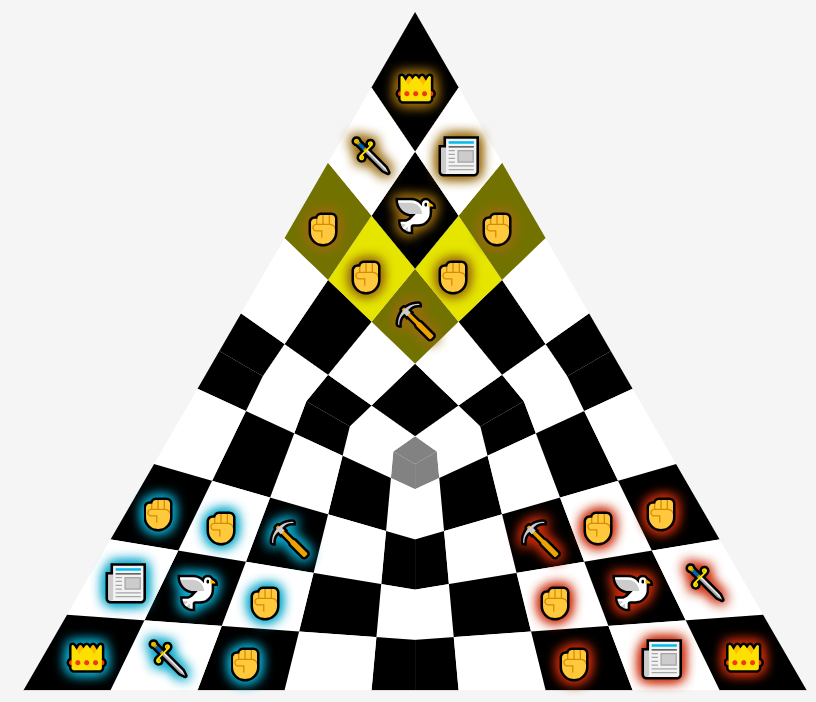

#### Un-curved Djambi-4: _(original flavor)_

#### Negatively-curved Djambi-5 to Djambi-8: 

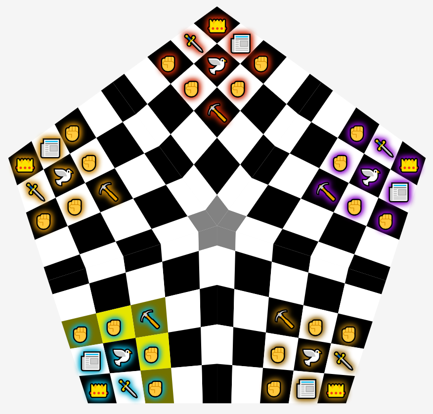  
  
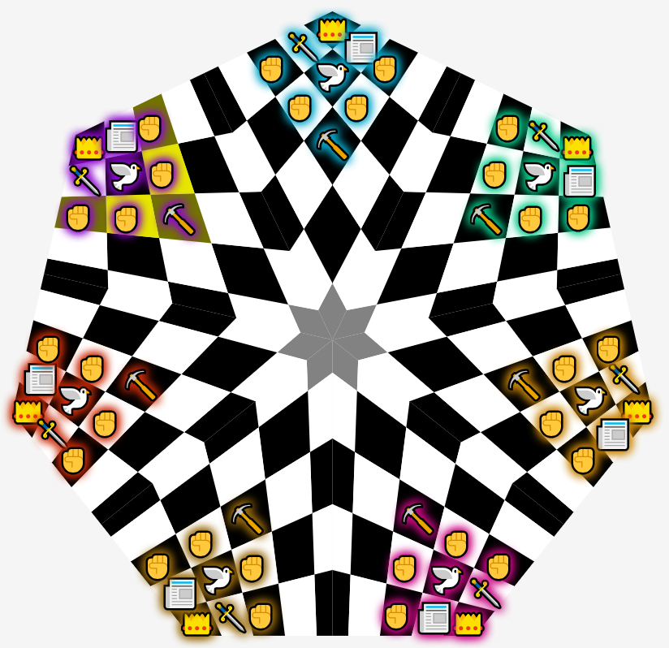  
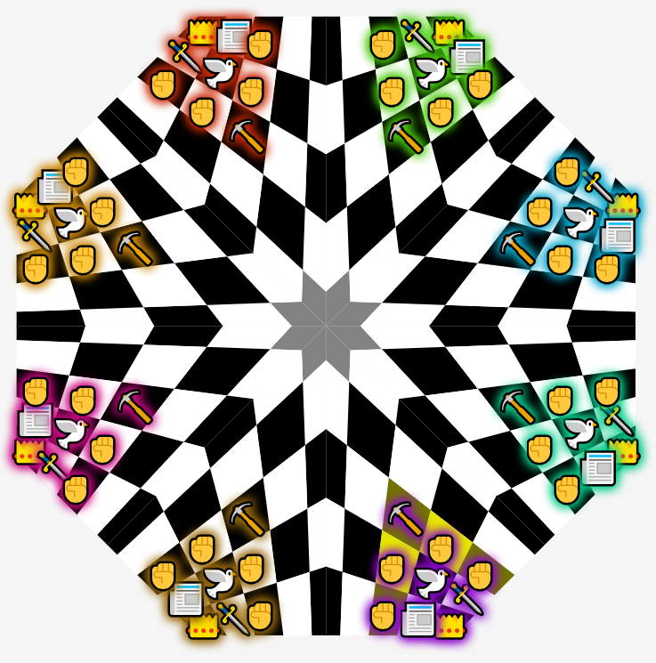

It would be possible to have Djambi-9 or higher, but there are a few problems that get worse as __N__ gets larger:
- It gets more difficult to visually recognize "straight" lines on the grid.
- The pace of the game slows down because there will be __N-1__ turns before you go again.
- More players are in the regions of the board that are curved away from you, so out-flanking other players becomes harder. In any curvature, it is easy to attack the two players next to you, and you can move through the center to attack the player opposite you. In negative curvature you can move pieces diagonally to attack a player next to the player next to you, but players that are 3 or more away from you require more than one move to attack.

### What counts as a "straight" line?
- If a piece is moving horizontally or vertically, it moves into a cell by crossing one side and out by crossing the opposite side. You can never move into a cell from one side and out through the next side over.

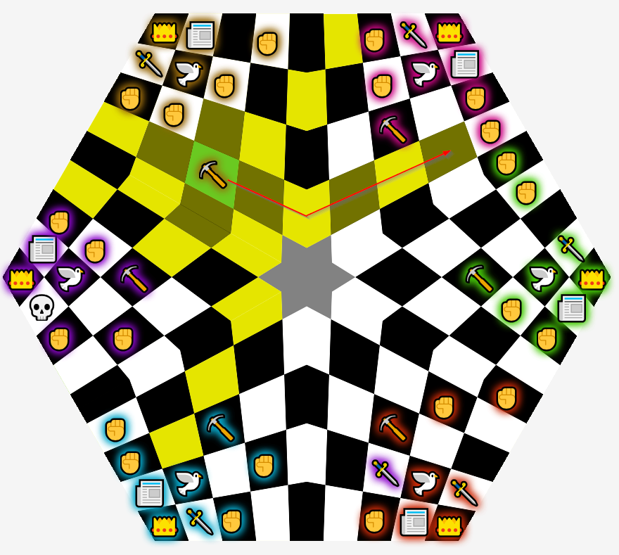

- If a piece is moving diagonally, it moves into a cell by crossing one corner and out by crossing the opposite corner. You can never move into a cell from one corner and out through the next corner over.

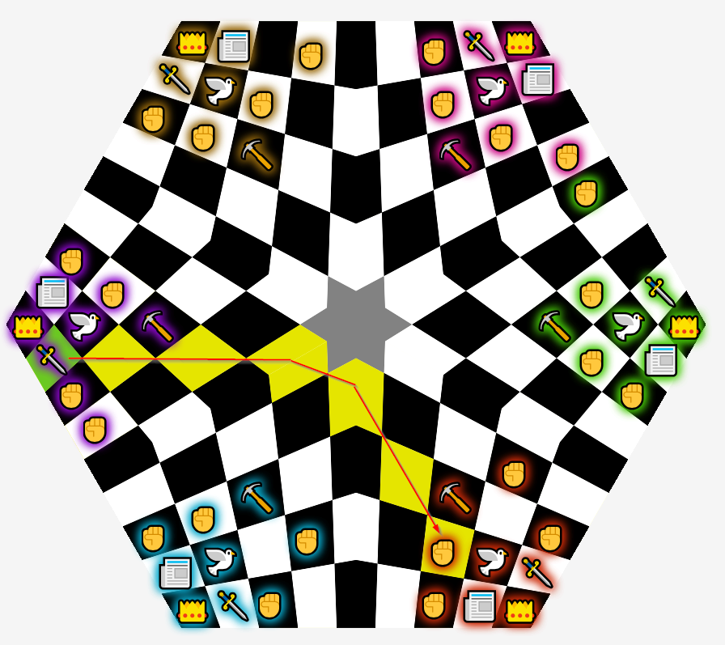

- You cannot move into a cell by crossing a side and out by crossing a corner, or vice versa.

- On boards where __N__ is odd, _The Seat_ is an exception to these rules. This is the only exception. If __N__ is odd and you move into _The Seat_ by crossing a side then you must move out by crossing the opposite corner, and vice versa.

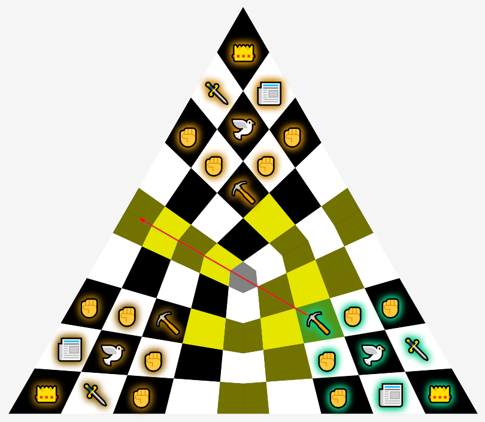

### Other changes from Djambi
- In Djambi, when a _Reporter_ moves, it can kill a piece that is horiztonally or vertically adjacent to the cell it lands in. For simplicity, in Djambi-N this is changed to allow diagonal kills as well.
- In Djambi, each _Assassin_ starts facing another player's _Assassin_, and each _Reporter_ faces another player's _Reporter_. In Djambi-N, each player's _Reporter_ faces the _Assassin_ of the next player clockwise. This change allows consistent symmetry for any number of players.

[1]: https://en.wikipedia.org/wiki/Djambi
[2]: https://en.wikipedia.org/wiki/Euclidean_geometry
[3]: https://en.wikipedia.org/wiki/Spherical_geometry
[4]: https://en.wikipedia.org/wiki/Hyperbolic_geometry