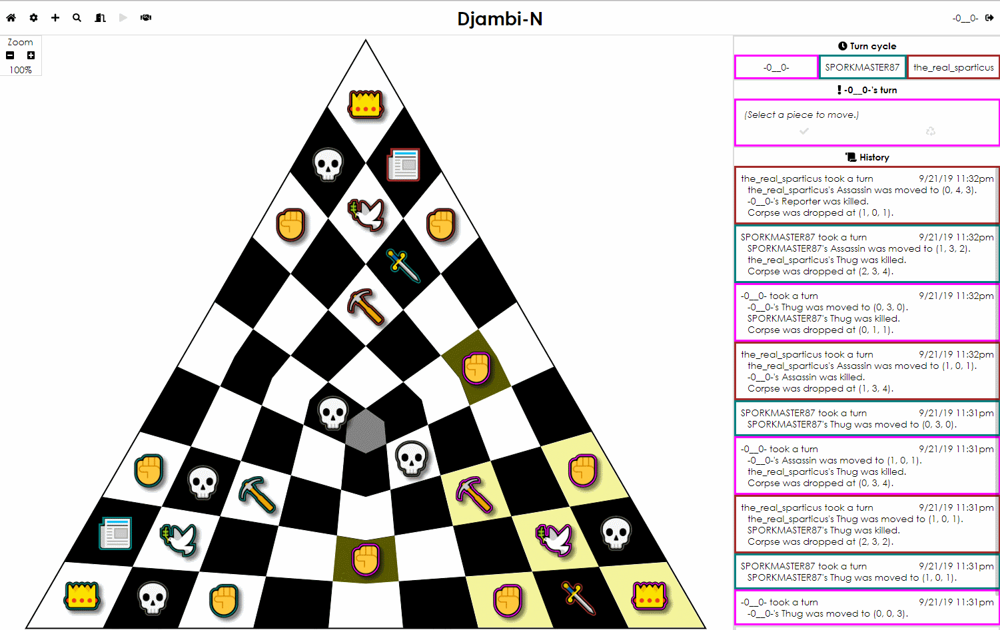

# Djambi-N

Djambi-N is like Chess, except

1. It is designed for more than two players. You can play with two players if you want, but it's less fun.
2. Pieces never leave the board. You can kill can enemy piece, but its corpse still takes up space on the board.
3. The board is always made out of squares, but the board itself isn't always square.

Points 1 and 2 are the premise of [Djambi][1], by Jean Anesto. Djambi-N adds point 3.

For help or more information, see the [wiki][2].

[Contribution guidlines][3]

[1]: https://en.wikipedia.org/wiki/Djambi
[2]: https://github.com/GamesFaix/Djambi3/wiki
[3]: CONTRIBUTING.md
