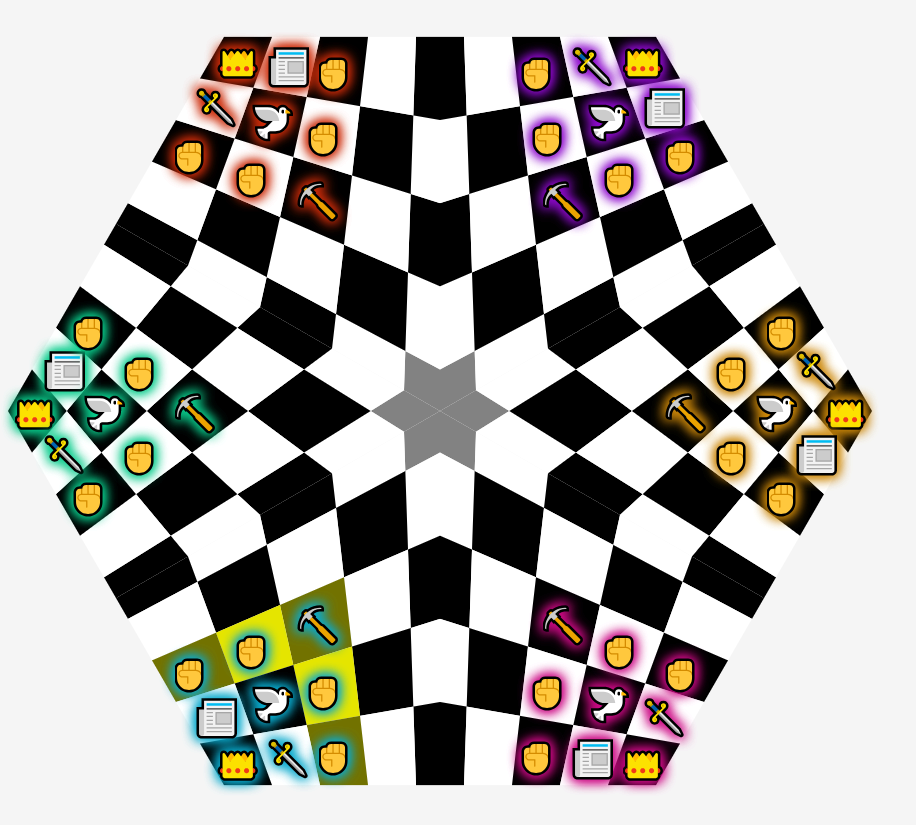

# Djambi-N

Djambi-N is a variation of the Chess-inspired board game, [Djambi][1], by Jean Anesto.

Complete rules for Djambi and Djambi-N can be found [here][2]. Basically Djambi-N is _kind of_ like Chess except:
1. It is designed for 3 to 8 players. You can play with 2 players if you want, but it's less fun.
2. Pieces never leave the board. You can kill can enemy piece, but its corpse still takes up space on the board.
3. If a piece moves the length of the board, turns left, moves the length of the board, turns left, moves the length of the board, turns left, and moves the length of the board a fourth time, it _may_ not be back where it started.

Current progress on Djambi-N can be found [here][3].

[1]: https://en.wikipedia.org/wiki/Djambi
[2]: docs/Rules.md
[3]: docs/Progress.md